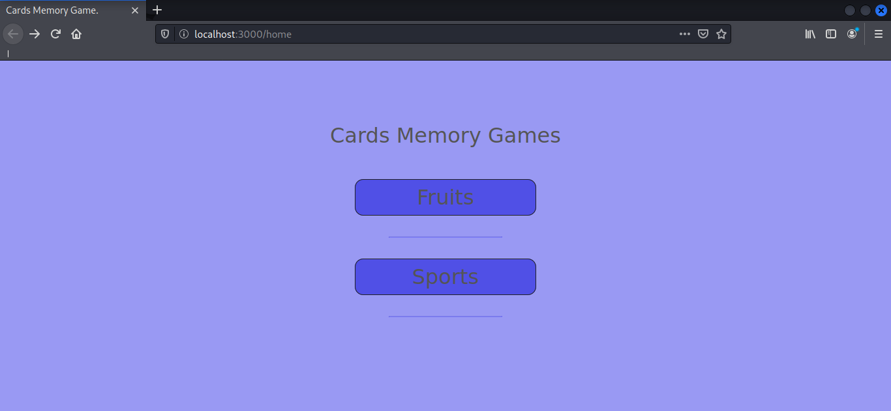

# Python Memory Games.

__This is a web application maked with python3, flask and javascript. With somes games of memory for play in the browser.__

## Dependencies.

__This only depend of flask module. Execute:__

```bash
$ pip3 install flask
```

__Or install of requirements file:__

```bash
$ pip3 install -r requirements.txt
```

## Run.

__For run execute:__

```bash
$ python3 index.py
```

__And visit your browser in:__ ***localhost:3000***

## Screenshot.



## Notes.

__Somes cards of the game take in load and therefore generate bugs, because they are a bit heavy.__